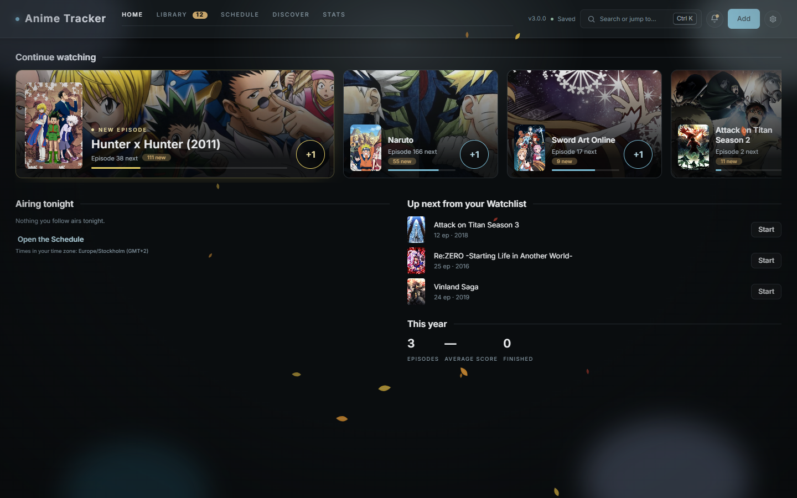
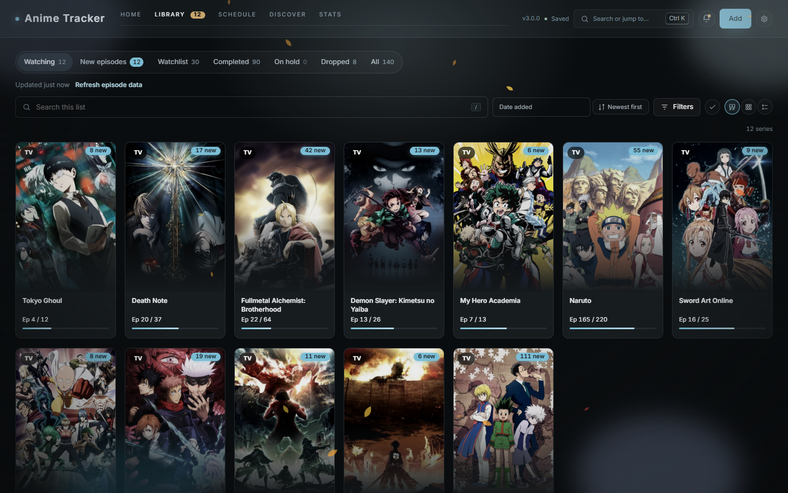
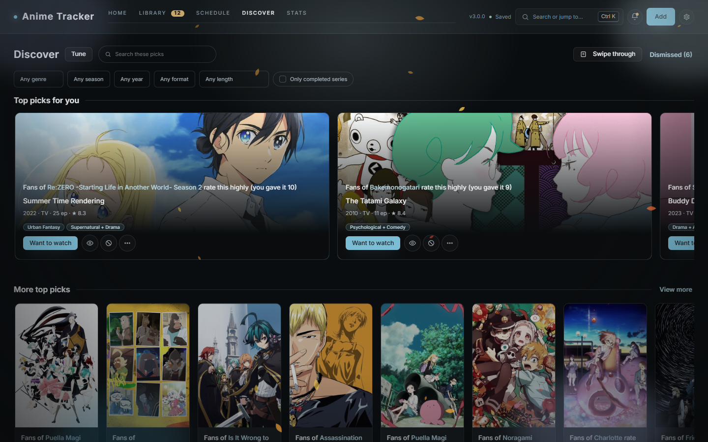
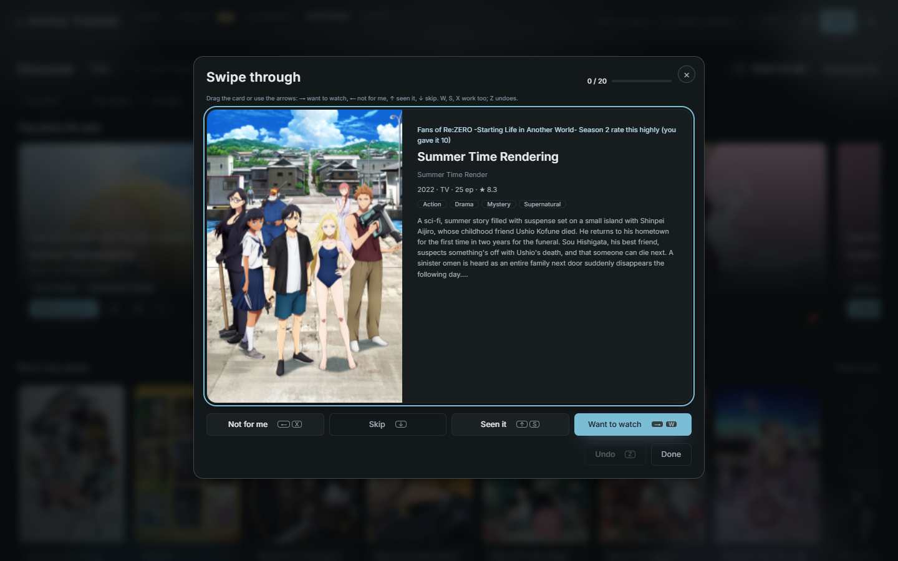
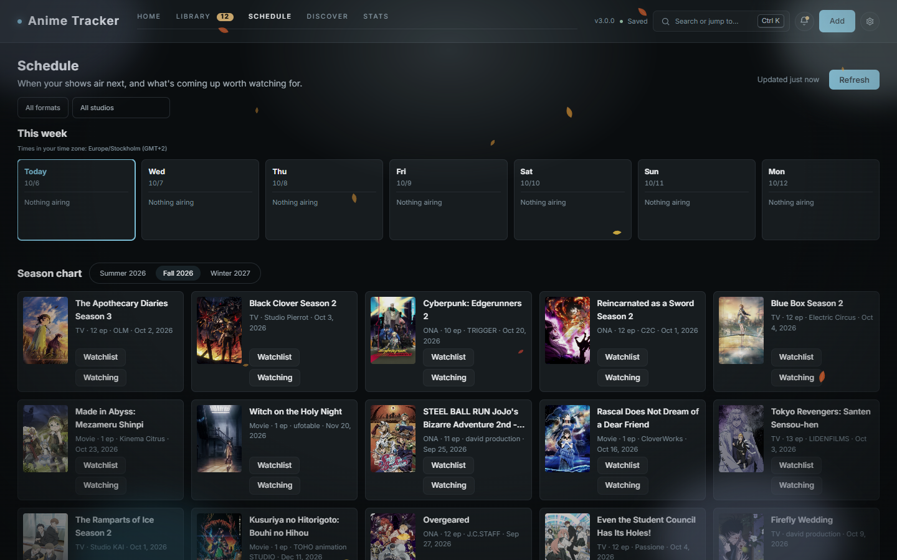

# Anime Tracker

A local anime tracker for your own computer. Keep track of what you are watching, what is next and what you have finished, see when new episodes air, and find something new to watch. There is no account and no cloud: your library stays on your computer. The app only goes online to talk to [AniList](https://anilist.co) (searching, airing times, covers and the Discover catalogue).



| Library | Discover |
|---|---|
|  |  |
| **Swipe through** | **Schedule** |
|  |  |

*Screenshots use a demo library.*

## Features

- **Library**: tabs for Watching, New episodes, Watchlist, Completed, On hold, Dropped and All, with counts. +1 marks the next episode, with Undo. Grid, compact or list view, one Filters panel, saved views, notes, tags and your own lists.
- **Home**: continue where you left off, what airs tonight, what is next on your Watchlist, and this year's numbers.
- **Discover**: recommendations from your own ratings and AniList's "fans of this also liked", each with the reason it was picked. Answer with Want to watch, Seen it or Not for me, or press T to **swipe through** one card at a time (drag, arrow keys or W / S / X).
- **Schedule**: this week's episodes in your own time zone, countdowns, and a season chart.
- **Stats**: episodes and hours watched, scores, genres and a watch diary.
- **Search and commands** (Ctrl+K): find a series, mark an episode, jump anywhere, change the theme.
- **Imports**: MyAnimeList (XML export), AniList (by username) and backup files, each with a review step and an Undo.
- **Episode notifications**, also when no browser tab is open (optional).
- **12 themes**, light and dark, and a decoration level from Off to Insane, with seasonal particles.
- **Keyboard first**: press ? for every shortcut.

What changed in 3.0 is in [CHANGELOG.md](CHANGELOG.md).

## Install (Windows)

1. Download `AnimeTracker.exe` from the [latest release](https://github.com/czar1337/anime-tracker/releases/latest).
2. Double-click it. Your browser opens the app, and an Anime Tracker icon appears in the system tray (bottom right). Use the icon to open the app again, open the data folder, or quit.

That's it: no installer and no Node.js needed. Put the exe wherever you like.

**Windows SmartScreen.** The exe is not code-signed, so the first time you run it Windows may show "Windows protected your PC". Click **More info**, then **Run anyway**. You can check that your download is the published file with the SHA-256 checksum in the release notes:

```powershell
Get-FileHash .\AnimeTracker.exe -Algorithm SHA256
```

**Updating.** Quit the app from its tray icon and replace the exe with the new one. Your data lives elsewhere and is not touched (see below). The app shows a small banner when a newer version is out; it never downloads or installs anything by itself.

## Where your data lives

Your library, activity log, covers, backups, snapshots and the Discover catalogue live outside the program, in your user folder:

- **Windows:** `%APPDATA%\anime-tracker\`
- **macOS:** `~/Library/Application Support/anime-tracker/`
- **Linux:** `~/.local/share/anime-tracker/` (or `$XDG_DATA_HOME/anime-tracker/`)

Settings → Data shows the exact folder the app uses.

**Upgrading from an older version** (2.x, or 1.x from 1.2 on) is automatic. The first start of 3.0 takes a verified snapshot of your library, keeps it permanently, then upgrades the file. Nothing is removed. If the library file is damaged, the app opens nothing, changes nothing and offers your backups instead.

## Backups

- **Automatic:** a backup on every save (the last 50, one per day for a month, one per month after that) in `backups/`, and verified snapshots in `snapshots/`, inside the data folder.
- **Your own copy:** quit the app and copy the whole data folder somewhere safe. That folder is everything: library, covers and settings.
- **One file:** Settings → Data → **Download my data**, or "Export library" in Ctrl+K, saves your library, settings and history as one JSON file. Bring it back with **Backup and restore** in the same place.

## Build from source

You need [Node.js](https://nodejs.org) 24 and Git.

```bash
git clone https://github.com/czar1337/anime-tracker.git
cd anime-tracker
npm ci
npm start
```

The app runs at `http://localhost:4321`. It has no runtime dependencies; the dev dependencies are for tests and the exe build.

- `npm test`: unit tests. `npx playwright install chromium`, then `npx playwright test`: end-to-end tests (each on its own temp data folder).
- `node scripts/build-exe.js`: builds the standalone `dist/AnimeTracker.exe` (Windows). `node scripts/smoke-exe.js` checks it.
- `start.bat` / `start.sh` start the app from a source checkout too.

How it is built, and the rules that keep your data safe, are in [docs/architecture.md](docs/architecture.md).

## Privacy

Everything stays on your computer. The app listens only on your own machine (localhost) and refuses requests from other websites. It sends nothing anywhere except requests to AniList for public anime data (and a check on GitHub for a newer version, once a day).
